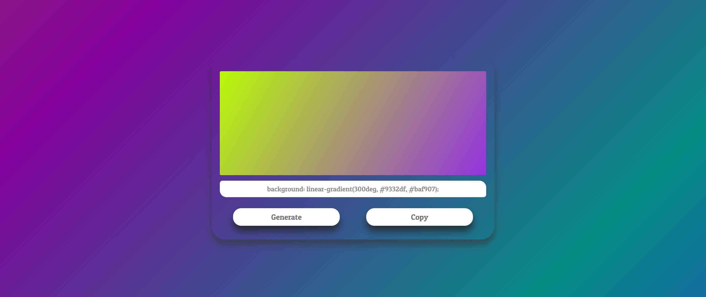

<h2 align="center">Gradient Generator</h2>
 

 
 
Uma ferramenta simples para gerar gradientes de cores de forma rápida e fácil. Com este gerador, você pode criar gradientes personalizados que podem ser usados em projetos de design, desenvolvimento web, ilustrações e muito mais.
 

# Contribuição
 

Se você quiser contribuir para o desenvolvimento do Gradient Generator, fique à vontade para fazer um fork deste repositório e enviar suas alterações por meio de pull requests. Sua contribuição é muito apreciada.
 

## Problemas e sugestões
 

Se você encontrar algum problema ou tiver alguma sugestão de melhoria, você pode entrar em contato comigo por meio do meu perfil no <a href="https://github.com/SidneyTeodoroJr" target="_blank">GitHub</a> ou pelas minhas redes sociais listadas a baixo.

 
 

<a href="https://www.instagram.com/sidneyteodoroaraujo" target="_blank">

